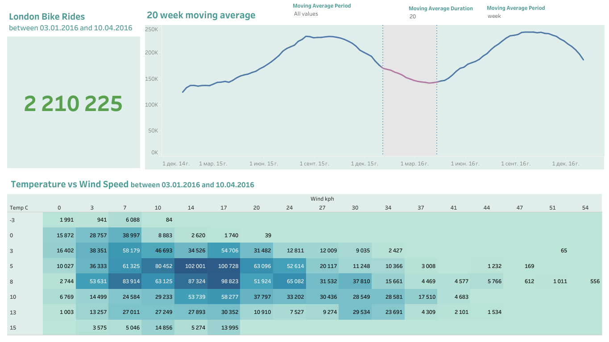
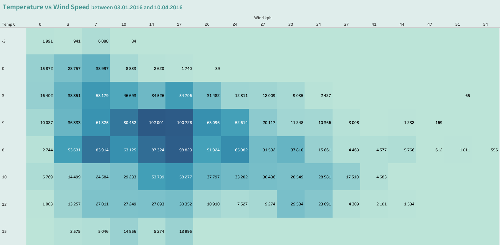
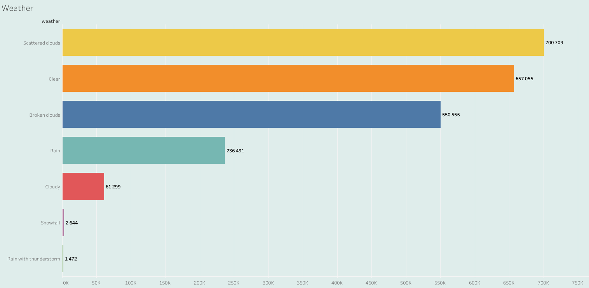
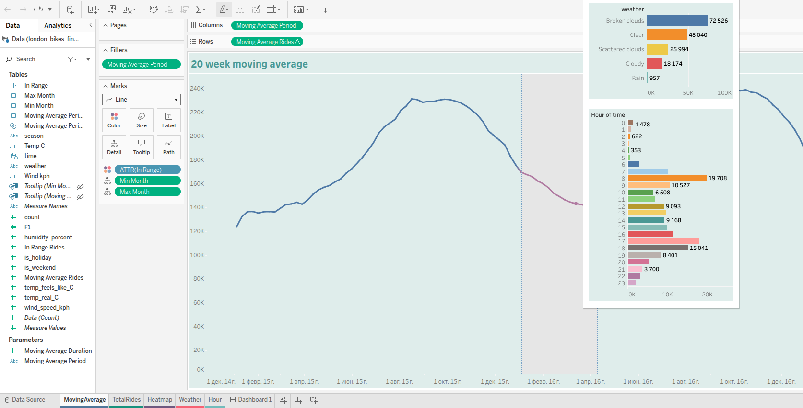

# 🌿 Portfolio Project: London Bike Sharing Analysis 🌿




## 📘 О проекте
https://public.tableau.com/views/LondonBikeSharingDataset_17480286695360/Dashboard1?:language=en-US&:sid=&:redirect=auth&:display_count=n&:origin=viz_share_link

Этот проект демонстрирует мои навыки работы с данными на примере анализа поездок на велосипедах в Лондоне.  

**Цели проекта:**
- **Извлечение** данных из открытого набора данных Kaggle — *London Bike Sharing Dataset*.
- **Преобразование**: очистка, переименование столбцов, декодирование погодных и сезонных значений с помощью Python/Pandas.
- **Визуализация**: создание интерактивного дашборда в Tableau.

**Стек:** Python, Pandas, openpyxl, Tableau, UV (управление зависимостями)

<!-- This is a repository to showcase skills, share projects and track my progress in Data Analytics / Data Science related topics. -->


## 🚀 Основные возможности

**Tableau:**
- 5 визуализаций
- Скользящее среднее
- Тепловая карта
- Разделение поездок по погоде и времени суток
- Set actions
- Пользовательские параметры
- Фильтр по временной шкале


**Data Engineering:**
- Интерактивный дашборд
- Переименование столбцов для лучшей читаемости
- Маппинг числовых значений на текстовые (погода, сезон и др.)
- Использование UV для управления зависимостями

## 📦 Установка и запуск

1. **Клонируйте репозиторий:**
   ```bash
   git clone https://github.com/your-username/London-Bike-Sharing-Tableau.git
   cd London-Bike-Sharing-Tableau
   ```

2. **Установите [uv](https://github.com/astral-sh/uv):**
   ```bash
   pip install uv
   ```

3. **Установите зависимости:**
   ```bash
   uv sync
   ```

4. **Скачайте датасет с Kaggle (или используйте уже скачанный в репозитории):**
   - [London Bike Sharing Dataset](https://www.kaggle.com/datasets/hmavrodiev/london-bike-sharing-dataset)
   - Поместите файл в папку `data/`

5. **Запустите обработку данных (опционально):**
   ```bash
   uv run python script/main.py
   ```
На выходе вы получите `london_bikes_final.xlsx` файл, обработанный Pandas и готовый к загрузке в Tableau.

6. **Мой итоговый дашборд в Tableau:**
   - Онлайн-версия которуя я опубликовал на Tableau Public: [Публичный дашборд Tableau Public](https://public.tableau.com/views/LondonBikeSharingDataset_17480286695360/Dashboard1?:language=en-US&:sid=&:redirect=auth&:display_count=n&:origin=viz_share_link)

## 🖼️ Галерея





## 📂 Структура проекта

```
LondonBikeRides/
├── data/
│   ├── london_bikes_final.xlsx
│   └── london_merged.csv
    └── london-bike-sharing-dataset.zip
├── docs/
│   └── Dashboard.png
    └── Heatmap.png
    └── MovingAverage.png
    └── Weather.png 
├── script/
│   └── main.py
├── pyproject.toml
├── uv.lock
└── .gitignore
```

## 📎 Полезные ссылки

- [Датасет на Kaggle](https://www.kaggle.com/datasets/hmavrodiev/london-bike-sharing-dataset)
- [Документация UV](https://github.com/astral-sh/uv)
- [Tableau Public Dashboard](https://public.tableau.com/views/LondonBikeSharingDataset_17480286695360/Dashboard1?:language=en-US&:sid=&:redirect=auth&:display_count=n&:origin=viz_share_link)
